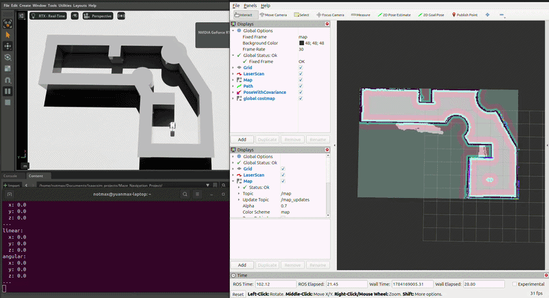
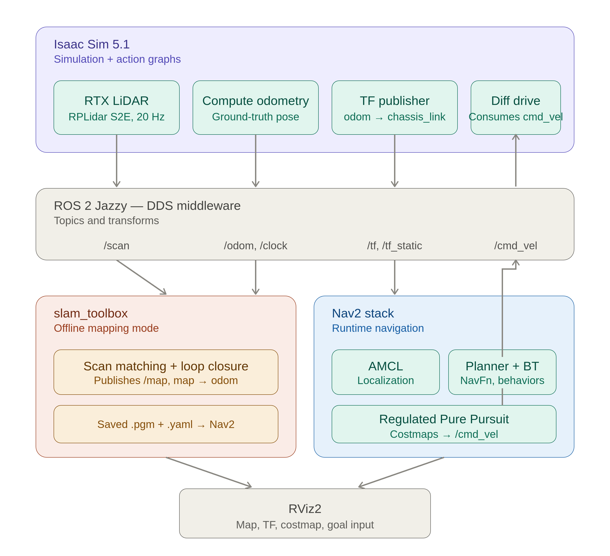
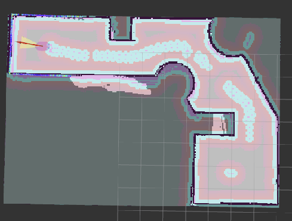

# Autonomous Maze Navigation — Nova Carter in Isaac Sim
Autonomous SLAM + Nav2 navigation stack for a custom maze environment,
built on NVIDIA Isaac Sim with a Nova Carter robot and ROS 2 Jazzy.

## Demo

## System Architecture

## Final SLAM Map

## Features
- SLAM mapping pipeline (slam_toolbox) for offline map generation
- Autonomous navigation with Nav2 stack (AMCL localization + Regulated Pure Pursuit controller)
- Full TF tree constructed from Isaac Sim action graphs (LiDAR, odometry, static + dynamic tf transformations)
- Real-time obstacle avoidance via local costmap with inflation layer + tuned pure pursuit parameters
- Custom teleop and cmd_vel publisher nodes for manual mapping runs

## Technical Stack
- Isaac Sim 5.1 with RTX rendering
- ROS 2 Jazzy on Ubuntu 24.04
- NVIDIA Nova Carter (differential drive, RPLidar S2E)
- slam_toolbox for mapping
- Nav2 with Regulated Pure Pursuit controller
- Python for custom nodes (teleop, cmd_vel publisher)

## Notable Engineering Challenges

### 1. Building the TF tree from scratch across Isaac action graphs
The map -> odom -> chassis_link -> lidar frame tf tree was manually implemented 
using Isaac Sim's custom nodes like Compute Odometry, Publish Raw Transformation Tree, 
and Publish Transformation Tree. Debugged frame priority conflicts where two publishers
fought over same parent-child frame relationship. Learned that SLAM required both /tf 
(dynamic transforms like odom -> chassis) and /tf_static (rigid sensor transformations).

### 2. QoS profile mismatch on /map topic
Rviz was not receiving map data despite all required topics for 
slam_toolbox were publishing. Learned that /map topic is published with volatile
(only sees new messages) instead of transient local durability (caches messages for 
late subscribers).

### 3. Diagnosing SLAM map warping through the sensor pipeline
Initial SLAM map showed a lot of double walls, meaning that odometry heading error
accumulated over time. Diagnosed that the /scan topic published at 6hz, compared to /odom 
publishing at 37hz. Low loop time of lidar compared to higher loop time of odom creates 
conflict where robot moves and updates position half-way between a lidar time, placing
each scan at a slightly rotated pose. This overall creates an inconsistent and buggy SLAM map.
Fixed by raising the RTX LiDAR's scanRateBaseHz in Isaac Sim to 20 Hz.

### 4. Tuning Nav2 Regulated Pure Pursuit
Robot reaches goal but overshoots final heading correction when
use_rotate_to_heading is set to true. Realizing that when robot drifts out of goal
and using a tight xy_goal_tolerance (0.01), it re-activates a lookahead point
creating large angular acceleration to get back on track, creating large overshoot.
Fixed by loosening tolerances above controller's natural settling error, accounting
for control loop latency.

## Debugging Toolkit
Commands that were consistently useful during development:
- `ros2 topic hz <topic>` — confirm topic publish rate
- `ros2 topic info <topic> --verbose` — check QoS profiles
- `ros2 run tf2_tools view_frames` — visualize TF tree
- `ros2 topic echo <topic>` — confirm topic content

## Future Work
- Using humanoid / quadruped instead of nova carter for adaptable terrain; learn RL locomotion policies
- April Tag + imu -> sensor fusion for enhanced localization
